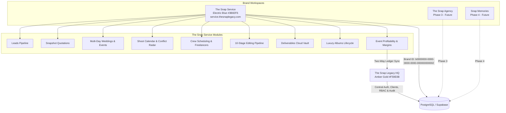

# The Snap Legacy ERP

An enterprise-grade, unified multi-brand Enterprise Resource Planning (ERP) platform architected for **The Snap Legacy** and its subsidiary brands: **The Snap Service**, **The Snap Agency**, and **Snap Memories**.

---

## 🏗️ System Architecture

```text
PHASE 1
The Snap Legacy Foundation + HQ
        │
        │ central auth
        │ central PostgreSQL
        │ central clients
        │ central finance
        │ central users/RBAC
        │ central audit
        ▼
PHASE 2
The Snap Service
        │
        ├── Leads
        ├── Quotations
        ├── Weddings / Events
        ├── Calendar
        ├── Team
        ├── Production
        ├── Editing
        ├── Deliverables
        ├── Albums
        └── Service Finance
        │
        ▼
Same Central ERP Database
```



---

## 🌟 Phase Overview

### Phase 1 — The Snap Legacy Foundation + HQ (Completed)
- **Central Multi-Brand Database**: Unified schema supporting all brands under one database instance with strict brand foreign keys.
- **Central Auth & RBAC**: Role-based access control (Super Admin, Brand Manager, Lead Photographer, Editor, Accountant) with audit logging on all mutations.
- **Central Clients Directory**: Unified customer database shared across all brands to prevent duplicate client entities and cross-sell services.
- **Central Financial Ledger**: Double-entry accounting, income/expense tracking, account balances, and automated brand financial consolidation.
- **HQ Executive Dashboard**: Real-time revenue analytics, brand performance breakdown, and recent cross-brand operational feeds.

### Phase 2 — The Snap Service Workspace (Completed)
Dedicated workspace for event photography, wedding cinematography, and luxury album production:
- **Multi-Day Weddings**: Treats multi-day Pakistani weddings (Mehndi, Barat, Walima) as **1 master project** with linked function records, unifying total contract values and logistics.
- **Shoot Calendar & Team Conflict Radar**: Real-time detection and visual warning banners whenever photographers, cinematographers, or drone pilots are scheduled for overlapping time slots across venues.
- **Quotation Engine with Snapshot Pricing**: Locks catalog rates at quotation creation time so future price adjustments never alter historic quotes.
- **Packages & Rate Card**: Full preservation of Silver (PKR 180k), Gold (PKR 350k), and Platinum (PKR 650k) packages from the legacy portal.
- **Crew Scheduling & Freelance Costs**: Dispatching core staff (*Zunair Ahmad, Umair Jabbar, Muhammad Arif, Shahid Jugnu*) and freelance pilots with call times, venue details, and payment tracking.
- **10-Stage Post-Production Pipeline**: Tracks media from `files_received` to `internal_review`, `client_proof`, `revision`, and `delivered`.
- **Deliverables Vault & Luxury Albums**: Cloud storage references (Google Drive, Dropbox, Frame.io) preventing database bloat; complete album binding and manufacturing lifecycle.
- **Event Profitability & Central HQ Sync**: Automated Gross Margin % calculation per event, with instant two-way synchronization into the central HQ financial ledger (`financial_transactions`).

---

## 🛠️ Technology Stack

- **Framework**: Next.js 16 (App Router with Turbopack)
- **UI Components**: Base UI (`@base-ui/react`), Tailwind CSS, Lucide React
- **Database & Auth**: PostgreSQL / Supabase
- **Hosting & Edge**: Vercel Edge Network with Next.js Middleware subdomain routing
- **Type Safety**: 100% TypeScript with zero compilation errors

---

## 🚀 Getting Started

### 1. Prerequisites
- Node.js 20+
- npm or pnpm

### 2. Environment Setup
Create a `.env.local` file in the root directory:
```env
NEXT_PUBLIC_SUPABASE_URL=your_supabase_project_url
NEXT_PUBLIC_SUPABASE_ANON_KEY=your_supabase_anon_key
SUPABASE_SERVICE_ROLE_KEY=your_supabase_service_role_key
NEXT_PUBLIC_DEMO_MODE=true
```

### 3. Install Dependencies
```bash
npm install
```

### 4. Run the Development Server
```bash
npm run dev
```
Open [http://localhost:3000](http://localhost:3000) for The Snap Legacy HQ or [http://localhost:3000/service](http://localhost:3000/service) for The Snap Service workspace.

### 5. Production Build
```bash
npm run build
npm run start
```

---

## 🌐 Brand Route Mapping

| Portal / Brand | Local Path | Production Domain | Brand ID |
| :--- | :--- | :--- | :--- |
| **The Snap Legacy HQ** | `/` | `thesnaplegacy.com` | Central / All |
| **The Snap Service** | `/service/*` | `service.thesnaplegacy.com` | `b0000000-0000-0000-0000-000000000002` |
| **The Snap Agency** | *(Phase 3)* | `agency.thesnaplegacy.com` | `b0000000-0000-0000-0000-000000000003` |
| **Snap Memories** | *(Phase 4)* | `memories.thesnaplegacy.com` | `b0000000-0000-0000-0000-000000000004` |

---

## 📜 License
Private & Proprietary — © The Snap Legacy. All rights reserved.
